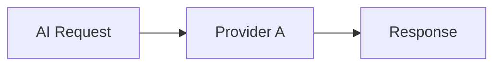
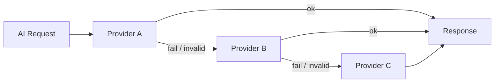
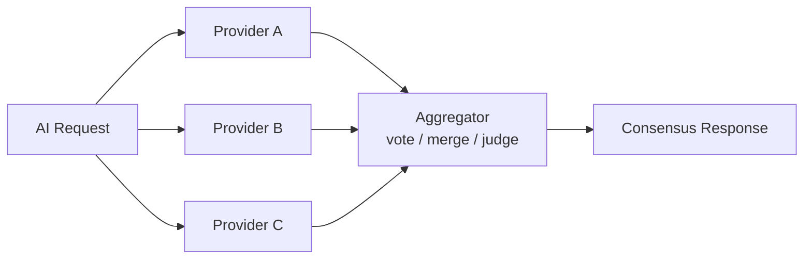
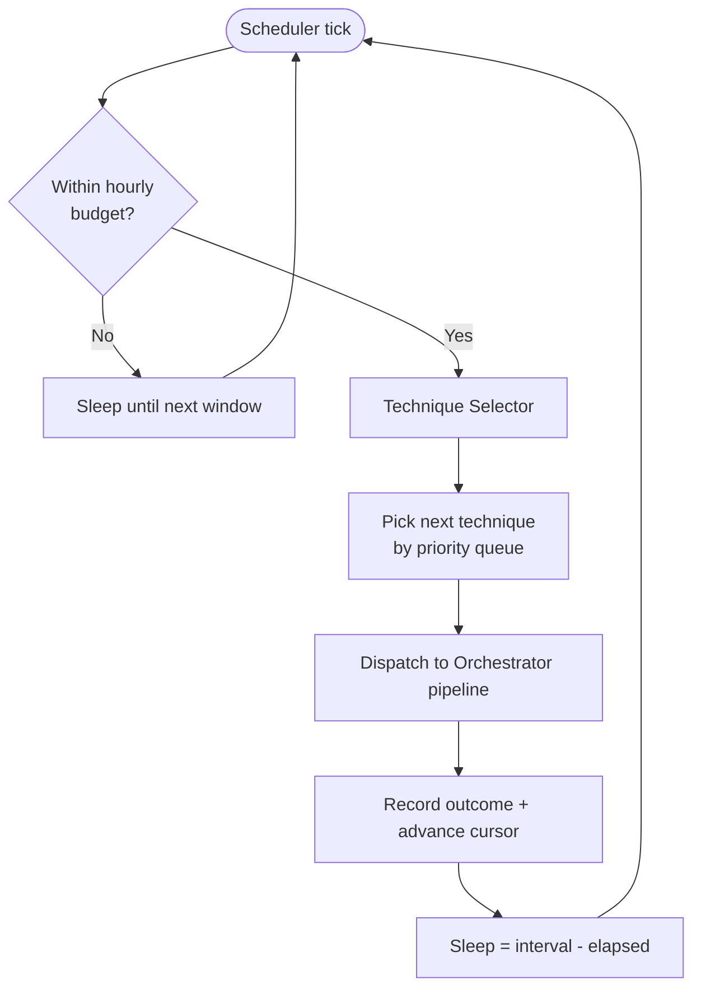
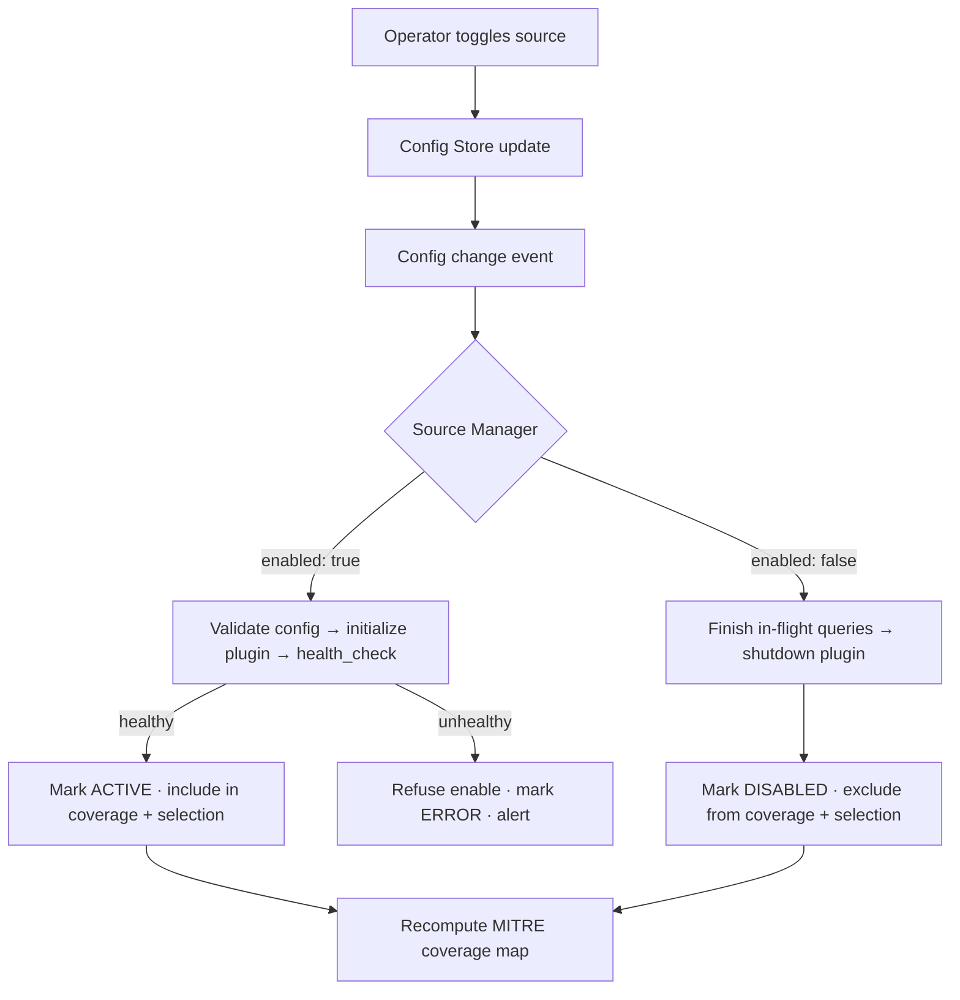
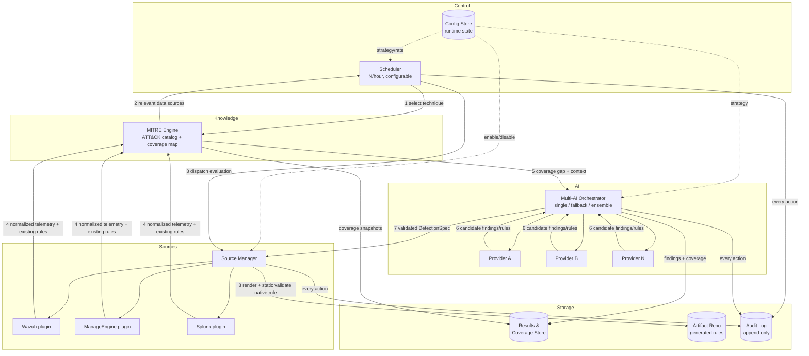

# Universal MITRE AI Agent — Architecture

> **Status:** DRAFT — pending approval. No implementation begins until this document is reviewed and approved.
> **Version:** 0.1.0
> **Last updated:** 2026-06-07
> **Runtime:** **Python 3.12+** (required minimum)

---

## 0. Technology Baseline

| Item | Decision |
|------|----------|
| **Language / runtime** | **Python 3.12 or higher** — required minimum, no support for earlier versions. |
| **Why 3.12+** | Native `typing` improvements (PEP 695 type-parameter syntax), faster interpreter, improved error messages, `Self`/`override` and modern `Protocol` support used by the plugin and provider interfaces, and `asyncio` enhancements relied on by the orchestrator and scheduler. |
| **Typing** | Fully type-annotated; `Protocol`-based interfaces (see §3, §4.1). Type-checked with a static checker (mypy/pyright) in CI. |
| **Concurrency** | `asyncio` for I/O-bound source queries and parallel AI calls (ensemble fan-out). |
| **Packaging** | `pyproject.toml` with `requires-python = ">=3.12"`. |
| **Style/quality** | Linting + formatting enforced (e.g., ruff); tests required for core logic. |

> All third-party dependencies must declare compatibility with Python 3.12+. The build/CI pipeline pins the minimum interpreter and fails on anything below 3.12.

---

## 1. System Goals

The **Universal MITRE AI Agent** is an autonomous detection-engineering assistant that continuously evaluates an organization's security telemetry against the [MITRE ATT&CK](https://attack.mitre.org/) framework, identifies detection gaps, and produces actionable, source-specific detection content.

### 1.1 Primary Goals

| # | Goal | Description |
|---|------|-------------|
| G1 | **Universal source support** | Pluggable connectors for multiple SIEM/log sources (Wazuh, ManageEngine, Splunk) that can be enabled/disabled at runtime without code changes or restarts. |
| G2 | **MITRE-driven coverage analysis** | Map available telemetry and existing rules to ATT&CK techniques; surface coverage gaps per tactic/technique. |
| G3 | **Multi-AI orchestration** | Support single-provider, fallback, and ensemble strategies across multiple LLM providers for resilience and quality. |
| G4 | **Continuous, paced evaluation** | Evaluate a configurable number of techniques per hour (default **5/hour**) to control cost, rate limits, and load. |
| G5 | **Actionable output** | Generate source-native detection rules (e.g., Wazuh rules, Splunk SPL, ManageEngine correlation rules) plus rationale and test guidance. |
| G6 | **Auditability & safety** | Every AI decision, source query, and generated artifact is logged, versioned, and reproducible. |

### 1.2 Non-Goals (v1)

- Automatic deployment of generated rules into production (human approval required).
- Real-time streaming detection (the agent is a batch/scheduled analyzer, not an inline detector).
- Replacing the SIEM's own correlation engine.

---

## 2. Core Components

```
┌──────────────────────────────────────────────────────────────────┐
│                      Universal MITRE AI Agent                       │
├──────────────────────────────────────────────────────────────────┤
│                                                                     │
│   ┌──────────────┐      ┌─────────────────┐     ┌──────────────┐   │
│   │  Scheduler   │─────▶│   Orchestrator   │◀───▶│ Config Store │   │
│   │ (paced loop) │      │  (work pipeline) │     │  (runtime)   │   │
│   └──────────────┘      └────────┬─────────┘     └──────────────┘   │
│                                  │                                  │
│         ┌────────────────────────┼────────────────────────┐        │
│         ▼                        ▼                         ▼        │
│  ┌─────────────┐        ┌────────────────┐        ┌──────────────┐ │
│  │   Source    │        │  MITRE Engine  │        │   Multi-AI    │ │
│  │  Manager    │        │ (ATT&CK model, │        │ Orchestrator  │ │
│  │ (plugins)   │        │  coverage map) │        │ (providers)   │ │
│  └──────┬──────┘        └────────────────┘        └──────┬───────┘ │
│         │                                                │         │
│   ┌─────┴───────┬──────────────┐              ┌──────────┴──────┐  │
│   ▼             ▼              ▼              ▼                 ▼  │
│ ┌─────┐    ┌──────────┐  ┌─────────┐    ┌─────────┐      ┌─────────┐│
│ │Wazuh│    │ManageEng.│  │ Splunk  │    │Provider │ ...  │Provider ││
│ │plug.│    │  plug.   │  │ plug.   │    │   A     │      │   N     ││
│ └─────┘    └──────────┘  └─────────┘    └─────────┘      └─────────┘│
│                                                                     │
│   ┌──────────────────────────────────────────────────────────┐    │
│   │   Persistence: results store · audit log · artifact repo  │    │
│   └──────────────────────────────────────────────────────────┘    │
└──────────────────────────────────────────────────────────────────┘
```

### 2.1 Component Responsibilities

| Component | Responsibility |
|-----------|----------------|
| **Scheduler** | Drives the paced evaluation loop (N techniques/hour, configurable). Selects the next batch of techniques, respects rate limits, supports pause/resume. |
| **Orchestrator (pipeline)** | Coordinates a single evaluation unit: fetch telemetry → assess coverage → invoke AI → validate → persist. Owns retries, timeouts, and error handling. |
| **Config Store** | Single source of truth for runtime configuration: which sources are enabled, AI strategy, scheduler rate, provider credentials (refs, not secrets). Hot-reloadable. |
| **Source Manager** | Loads/unloads source plugins, exposes a uniform query interface, tracks per-source health and enable/disable state. |
| **MITRE Engine** | Holds the ATT&CK technique catalog, maps data sources/log types to techniques, computes coverage and gaps. |
| **Multi-AI Orchestrator** | Routes AI requests according to the selected strategy (single/fallback/ensemble), normalizes provider responses, handles provider errors and quotas. |
| **Source Plugins** | Concrete connectors (Wazuh, ManageEngine, Splunk) implementing the plugin interface. |
| **AI Providers** | Concrete LLM adapters implementing the provider interface. |
| **Persistence** | Results store (coverage + findings), append-only audit log, versioned artifact repository for generated rules. |

---

## 3. Plugin Interface

Source plugins are the extensibility boundary for telemetry sources. Every source — Wazuh, ManageEngine, Splunk, and future additions — implements the same interface so the rest of the system never needs source-specific code.

### 3.1 Source Plugin Contract

```python
class SourcePlugin(Protocol):
    # --- Identity & lifecycle ---
    name: str                      # unique id, e.g. "wazuh"
    display_name: str              # human label, e.g. "Wazuh"
    version: str

    def initialize(self, config: dict) -> None:
        """Validate config, establish connection/session. Idempotent."""

    def health_check(self) -> HealthStatus:
        """Return CONNECTED | DEGRADED | UNAVAILABLE with detail."""

    def shutdown(self) -> None:
        """Release connections/resources. Safe to call multiple times."""

    # --- Capability advertisement ---
    def supported_data_sources(self) -> list[DataSourceRef]:
        """ATT&CK data sources/components this connector can provide
        (e.g. 'Process: Process Creation', 'Network Traffic: Flow')."""

    def existing_rules(self) -> list[DetectionRule]:
        """Currently deployed detections, normalized, for gap analysis."""

    # --- Telemetry access ---
    def query(self, spec: QuerySpec) -> QueryResult:
        """Run a normalized query (time range, fields, filters);
        return normalized events. Must enforce read-only access."""

    # --- Detection authoring ---
    def render_rule(self, detection: DetectionSpec) -> RenderedArtifact:
        """Translate a source-agnostic DetectionSpec into native
        rule syntax (Wazuh XML, Splunk SPL, ManageEngine rule)."""

    def validate_rule(self, artifact: RenderedArtifact) -> ValidationReport:
        """Statically validate native syntax where possible
        (does NOT deploy)."""
```

### 3.2 Plugin Registration & Discovery

- Plugins are registered via an entry-point registry (name → factory).
- The **Source Manager** instantiates only **enabled** plugins (per Config Store).
- Enable/disable is a runtime state change — see §6.
- Plugins must declare a config schema; the Source Manager validates config on load and refuses to enable a misconfigured plugin (failing closed).

### 3.3 Built-in Plugins (v1)

| Plugin | Query mechanism | Rule rendering target |
|--------|-----------------|-----------------------|
| **Wazuh** | Wazuh Indexer (OpenSearch) API / Wazuh API | Wazuh decoder/rule XML |
| **ManageEngine** | Log360 / EventLog Analyzer API | ManageEngine correlation rule |
| **Splunk** | REST API + search jobs (SPL) | Splunk SPL / `savedsearch` |

---

## 4. Multi-AI Orchestrator

### 4.1 Provider Interface

```python
class AIProvider(Protocol):
    name: str                          # e.g. "anthropic", "openai-compatible"
    def complete(self, request: AIRequest) -> AIResponse: ...
    def health_check(self) -> HealthStatus: ...
    def cost_estimate(self, request: AIRequest) -> CostEstimate: ...
```

`AIRequest`/`AIResponse` are provider-agnostic (prompt, system, schema/JSON-mode flag, token limits, metadata). Each adapter maps to its native SDK.

### 4.2 Strategies

The orchestrator supports three selectable strategies (set in Config Store, switchable at runtime):

#### (a) Single
One configured provider handles every request. Lowest cost/latency, no redundancy.



#### (b) Fallback
Ordered provider list. Try the primary; on error, timeout, quota, or low-confidence/invalid output, fall through to the next. First successful, valid response wins.



#### (c) Ensemble
Fan out to multiple providers in parallel, then **aggregate**:
- **Vote/merge** for structured outputs (e.g., agree on technique mapping, union of detection ideas with de-duplication).
- **Judge** pass (optional): one provider scores/merges candidates into a final answer.
- Confidence is derived from agreement.



### 4.3 Cross-cutting Concerns

- **Normalization:** all strategies return the same `AIResponse` shape to the pipeline.
- **Validation:** responses are schema-validated (JSON) before acceptance; invalid → treated as failure (drives fallback / lowers ensemble vote).
- **Budgeting:** per-request and per-hour token/cost ceilings; the orchestrator refuses calls that would exceed budget and reports back to the scheduler.
- **Observability:** every provider call logs latency, tokens, cost, and outcome to the audit log.

---

## 5. Scheduler Design

### 5.1 Pacing Model

The scheduler evaluates a **configurable number of techniques per hour**, defaulting to **5/hour**.

- Config key: `scheduler.techniques_per_hour` (default `5`).
- Derived interval: `interval = 3600s / techniques_per_hour` → default **one technique every 12 minutes**.
- Two pacing modes (configurable via `scheduler.mode`):
  - **`even`** (default): spread evaluations evenly across the hour (every `interval` seconds). Smooths source and AI load.
  - **`burst`**: run the full batch of N at the top of each hour, then idle.



### 5.2 Technique Selection

A priority queue chooses the next technique each cycle, ordered by:
1. **Never-evaluated** techniques first (cold coverage).
2. **Staleness** — oldest `last_evaluated_at` next.
3. **Gap severity** — techniques with known coverage gaps and high prevalence/relevance.
4. **Enabled-source relevance** — only techniques observable by at least one *enabled* source are prioritized; techniques with no enabled telemetry are deferred and flagged.

A full ATT&CK pass therefore cycles continuously; at 5/hour ≈ 120/day, the full enterprise matrix (~200+ techniques incl. sub-techniques) is covered in roughly 2 days, then re-cycled by staleness.

### 5.3 Controls

| Control | Effect |
|---------|--------|
| `techniques_per_hour` | Throughput (also bounds cost). Hot-reloadable. |
| `mode` (even/burst) | Distribution within the hour. |
| `pause` / `resume` | Operator stop without losing the cursor. |
| `max_concurrent` | Cap on simultaneous in-flight evaluations (default 1). |
| Rate-limit guard | Honors source + AI provider rate limits; backs off and re-queues. |

### 5.4 Reliability

- **Cursor persistence:** the selection cursor and `last_evaluated_at` per technique are persisted, so restarts resume without re-doing work or losing pacing.
- **Idempotency:** re-evaluating a technique overwrites its latest result; the audit log keeps history.
- **Crash safety:** an in-flight evaluation that fails mid-run is re-queued, not silently dropped.

---

## 6. Source Selection Logic (Runtime Enable/Disable)

Sources (Wazuh, ManageEngine, Splunk) can be enabled or disabled **at runtime** with no restart.

### 6.1 State Model

Each source has runtime state in the Config Store:

```yaml
sources:
  wazuh:
    enabled: true
    config: { endpoint: ..., auth_ref: vault://wazuh, verify_tls: true }
  manageengine:
    enabled: false
    config: { endpoint: ..., auth_ref: vault://me }
  splunk:
    enabled: true
    config: { endpoint: ..., auth_ref: vault://splunk }
```

### 6.2 Enable/Disable Flow



### 6.3 Rules & Guarantees

- **Fail-closed enable:** a source that fails config validation or health check is **not** enabled; it is marked `ERROR` and excluded.
- **Graceful disable:** in-flight queries to a source being disabled are allowed to finish (bounded by timeout) before `shutdown()`.
- **Coverage recomputation:** enabling/disabling a source immediately recomputes the MITRE coverage map; technique selection priorities update accordingly.
- **No-source guard:** if **all** sources are disabled, the scheduler enters an idle/paused state and emits a warning rather than producing meaningless AI calls.
- **Per-source isolation:** one source being `UNAVAILABLE` never blocks evaluation against other enabled sources; affected techniques are flagged "telemetry unavailable."

---

## 7. Data Flow Diagram



**Flow summary:** Scheduler picks a technique → MITRE Engine identifies relevant data sources → Source Manager queries only enabled sources for telemetry + existing rules → MITRE computes the coverage gap → Multi-AI Orchestrator (per strategy) produces a source-agnostic `DetectionSpec` → the relevant plugin renders it into native syntax and statically validates it → results, artifacts, and a full audit trail are persisted. Human review precedes any deployment.

---

## 8. Security Considerations

### 8.1 Secrets & Credentials
- Source and AI credentials are **never** stored inline; the Config Store holds **references** (`vault://…`, env, or secret-manager keys) resolved at runtime.
- Credentials are redacted in all logs and audit entries.
- Least-privilege: source accounts are **read-only** for telemetry; rule deployment is out of scope for the agent (human-gated).

### 8.2 Source Access Safety
- Plugins enforce **read-only** queries; the `query()` path must not mutate source state.
- Per-source TLS verification on by default (`verify_tls: true`); disabling requires explicit config and is logged.
- Query bounds (time range, result caps) prevent runaway/expensive queries.

### 8.3 AI / Prompt Safety
- **Data minimization:** only the telemetry context needed for a technique is sent to providers; PII/sensitive fields are filtered/redacted before egress.
- **Prompt-injection resistance:** telemetry is treated as untrusted data, clearly delimited from instructions; AI output is schema-validated and never executed.
- **No auto-deploy:** generated rules are artifacts requiring human review; the agent cannot push detections to production.
- **Provider data handling:** provider choice records data-residency/retention posture; ensemble fan-out is bounded by data-egress policy.

### 8.4 Output & Artifact Integrity
- Generated rules are **statically validated** (`validate_rule`) before storage; nothing is deployed.
- Artifacts are versioned; each carries provenance (technique, sources used, AI strategy, providers, prompt hash).

### 8.5 Auditability & Tamper Resistance
- Append-only audit log of every source query, AI call (provider, tokens, cost, outcome), config change (who/what/when), and produced artifact.
- Reproducibility: enough metadata is captured to re-run an evaluation deterministically (within provider non-determinism limits).

### 8.6 Operational Safety
- **Fail-closed** on misconfiguration (sources/providers refuse to activate).
- Budget ceilings (tokens/cost per hour) prevent runaway spend.
- Rate-limit and backoff handling for both sources and AI providers.
- Config changes validated against schema before apply; invalid changes rejected without affecting the running state.

---

## 9. Open Questions (to resolve before/with approval)

1. **Persistence backend** — local files vs. embedded DB (e.g., SQLite) vs. external store?
2. **Concrete AI providers** for v1 (which adapters to ship)?
3. **ATT&CK catalog source** — bundle a pinned STIX snapshot vs. fetch/update from MITRE?
4. **Operator interface** — CLI only, config-file only, or a small API/UI for runtime toggles?
5. **Deployment target** — long-running service, container, or scheduled process?

---

> **Approval gate:** Per the project plan, implementation does **not** start until this Architecture document is reviewed and approved. All files are kept **local**; the repository will be pushed to GitHub manually by the maintainer.
